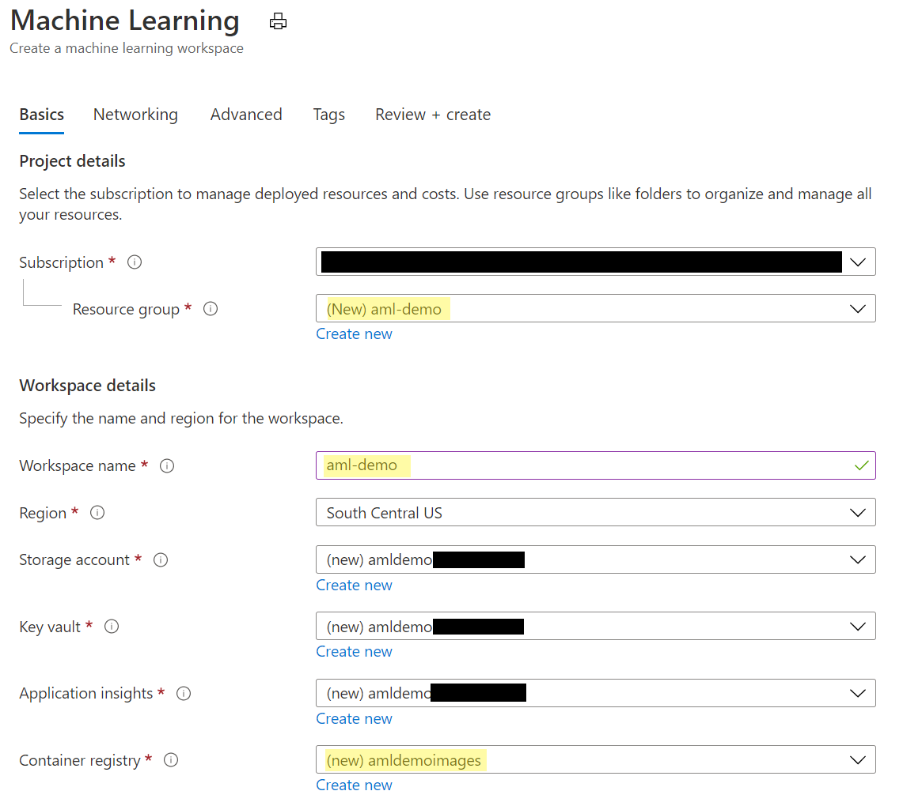

# Prerequisites

## Create Azure Machine Learning Workspace

This tutorial assumes that you have an Azure Machine Learning service provisioned. If you do not have one yet, please follow [this tutorial](https://docs.microsoft.com/en-us/azure/machine-learning/how-to-manage-workspace#create-a-workspace). This repo uses the following values:

* **Workspace name:** `Create new` using `aml-demo`
* **Resource group name:** `aml-demo`
* **Region:** Accept default region
* **Storage account:** Accept (new) default
* **Key vault:** Accept (new) default
* **Application insights:** Accept (new) default
* **Container registry:** `Create new` with a unique name

AML will automatically create a Container registry instance for you upon first running a training experiment. For this example, we want to create it at Workspace creation time to hold [R Environment](01-Renvironment.md) images.

See below for an example:



## Create Development Environment

Depending on your preference, you can either work directly on your local laptop using Docker (Path 1), or remotely connect to a `Compute Instance` (Path 2). Both paths will work, but depending on your system restrictions (e.g., not full admin rights to your laptop), you might want to use Path 2.

Both paths cover how to leverage Azure Machine Learning for performing demanding, long-running training and batch-scoring jobs in the cloud.

### Path 1 - Using your Local Laptop

Follow this path if:

* You want to work fully locally on your laptop
* You can fullfil all these prerequisites:
    * You have full admin rights on your laptop
    * You have `docker` installed (see [here](https://docs.docker.com/get-docker/))
* **Note:** This path does not support local testing using GPUs

Some parts might already be fulfilled (editor, SSH keys), hence feel free to skip those steps.

1. Execute your R code on local laptop using `Rscript` to make sure it is working properly.

1. Install Azure CLI
    * Follow the documentation [here](https://docs.microsoft.com/en-us/cli/azure/install-azure-cli?view=azure-cli-latest) to install the Azure CLI.
    * macOs (using `brew`): `brew update && brew install azure-cli`
    * Windows: Download [installer](https://aka.ms/installazurecliwindows)

1. Login to Azure CLI
    ```
    az login
    ```

1. Install the [AZ ML CLI extension](https://docs.microsoft.com/en-us/azure/machine-learning/reference-azure-machine-learning-cli)
    ```
    az extension add -n azure-cli-ml
    ```

### Path 2 - Using a Compute Instance

Follow this path if:

* You want (or are required) to work with a cloud-hosted machine in the background
* You do not have full admin rights on your laptop and have challenges installing, e.g., `docker`
* Want the most proven way possible

Some parts might already be fulfilled (editor, SSH keys), hence feel free to skip those steps.

1. Execute R code on local laptop using `Rscript` to make sure it is working properly.

1. *Optional* Setup local Visual Studio Code with remote extension and R support
    * Install [Visual Studio Code](https://code.visualstudio.com/) 
    * Install [Remote Development](https://marketplace.visualstudio.com/items?itemName=ms-vscode-remote.vscode-remote-extensionpack)
    * Install [R support for Visual Studio Code](https://marketplace.visualstudio.com/items?itemName=Ikuyadeu.r)


1. Generate SSH Key
    * Open Terminal
    * Generate SSH key using `ssh-keygen -t rsa -b 4096`
    * Open `~/.ssh/id_rsa.pub` with an editor of your choice and copy the public key

1. Provision Compute Instance in Azure Machine Learning
    * Open [Azure Machine Learning Studio UI](https://ml.azure.com)
    * Navigate to `Compute --> Compute Instances`
    * Select `Create`
    * Select a `Virtual Machine Type` (CPU is default)
    * Select a `Virtual Machine size` (e.g. Standard_DS3_v2)
    * Click Next
    * Enter a name for the Compute Instance (e.g. aml-demo-ci)
    * Enable `SSH Access`
    * Paste your public key from `~/.ssh/id_rsa.pub` in `SSH public key`
    * Select `Create`
    
    * Wait until instance has been provisioned

1. Connect to RStudio Server on the Compute Instance
    * On the Compute Instances page, select `RStudio` to start a remote RStudio Server session in your browser. R are preinstalled for you on the Compute Instance. The Azure CLI with ML extension is preinstalled and is usable through the RStudio Terminal window.

1. *Optional* Connect remotely to the Compute Instance using Visual Studio Code
    * On the Compute Instances page, select `SSH` under Application URI and copy the `Login using local account` command
    

    * Start `Visual Studio Code`
    * Select `Remote Explorer`
    * Click `+ Add new SSH Target`
    * Paste copied command `ssh azureuser@*.*.*.* -p *`
    * Save update to `C:\Users\username\.ssh\config` (Windows) or `~/.ssh/config` (macOS, Linux)
    * Right-click the new `SSH Targets` entry and select `Connect to Host in Current Window`

## Clone This Template To Use With Your Code

1. Create a new Git repository from this repo and open it
    * Open [this template repo](https://github.com/microsoft/aml-acceleration-template) in a new browser tab and click `Use this template` and create a new repo from it
    
    * In RStudio or vscode, open a `Terminal`
    * Clone your newly created repo:
    ```
        git clone <URL to your repo>
    ```

1. Copy your Machine Learning code into the repository
    * Copy your existing Machine Learning code to the [`src/model1/`](../src/model1/) directory
    * If you already have a `train.py` or other conflicting filenames, just rename the existing examples for later use as reference

    * However, be aware to follow the `train.py` outline with parameters for inputting the source for data path

Now that you have your development environment up and running, we can move to the [next section](01-Renvironment.md) and create an R environment for AML.